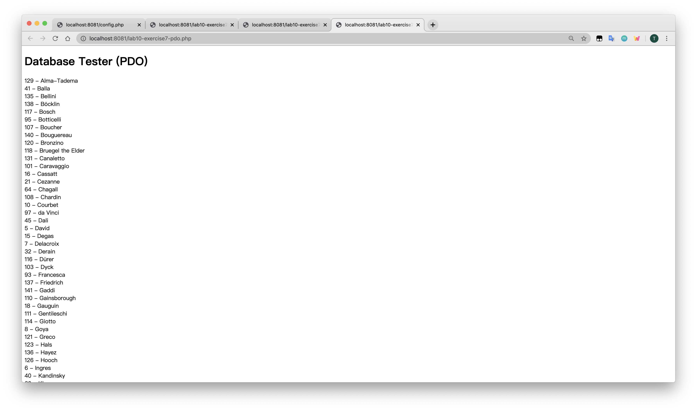
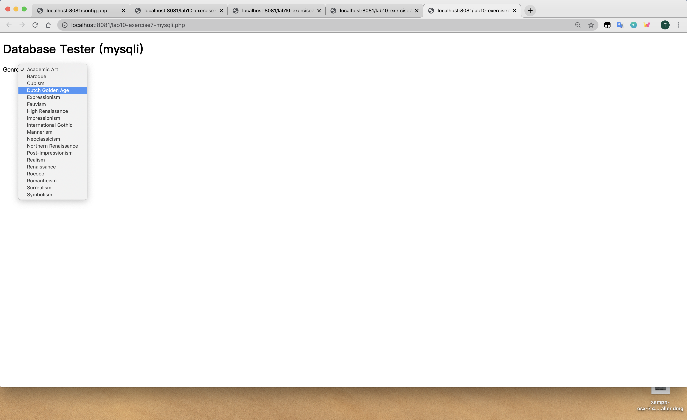
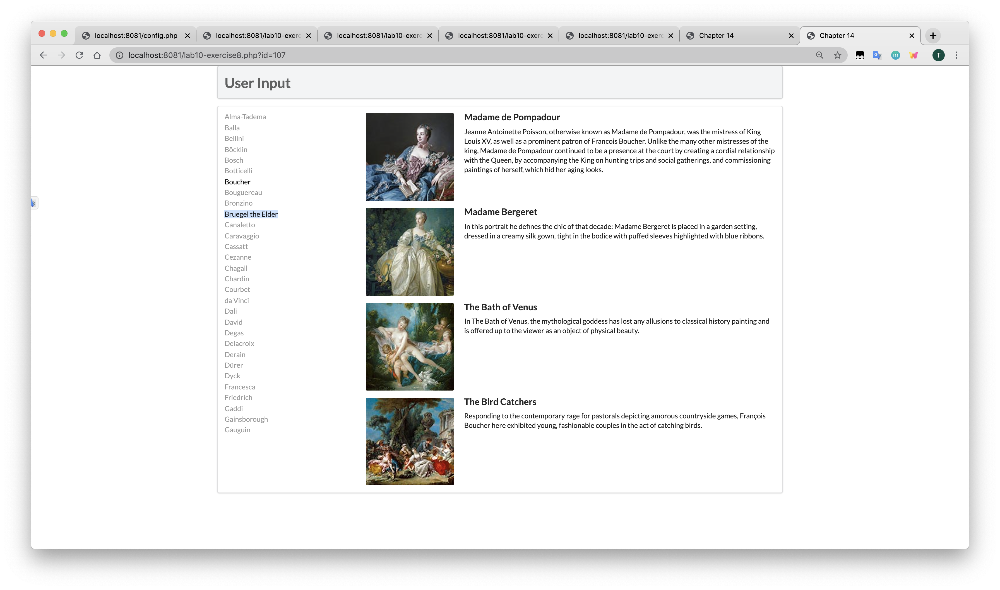

lab10设计文档
====

### Exercise 7

###### pdo访问数据库：

>`try...catch`机制处理错误
>
>`$pdo = new PDO(DBCONNSTRING,DBUSER,DBPASS);`建立数据库联系，新建PDO对象
>
>`$pdo->setAttribute(PDO::ATTR_ERRMODE, PDO::ERRMODE_EXCEPTION);`设置错误处理模式
>
>`$sql = "select * from Artists order by LastName";` 设置sql语句（获取Artists中的所有数据并根据LastName排列）
>
>`$result = $pdo->query($sql);`执行sql语句并将结果赋给`$result`
>
>`while ($row = $result->fetch()) {
     echo $row['ArtistID'] . " - " . $row['LastName'] . " "; 
  }` 遍历执行结果并输出
>  
> `$pdo = null;`释放资源
  
###### mysqli 访问数据库

> `$connection = mysqli_connect(DBHOST, DBUSER, DBPASS, DBNAME);` 调用`mysqli_connect()`建立联系并将结果赋值给`$connection`
>
>`if ( mysqli_connect_errno() ) {
    die( mysqli_connect_error() ); 
 }`连接数据库错误处理
>
>`$sql = "select * from Genres order by GenreName"; `设置sql语句（获取Genres所有数据并按照GenreName排列）
>
>`if ($result = mysqli_query($connection, $sql)) {
    while($row = mysqli_fetch_assoc($result)) {
       echo '<option value="' . $row['GenreID'] . '">'; 
       echo $row['GenreName'];
       echo "</option>";
    }
>   mysqli_free_result($result); 
}` 用`mysqli_query($connection, $sql)`执行sql语句并将结果赋值给`$result`，遍历结果并输出，遍历结束释放资源
>
>`mysqli_close($connection);`关闭连接

### Exercise 8

`function outputArtists()` 与Exercise 7大体相似，输出部分用到了`$_SERVER["SCRIPT_NAME"]`填充`href`，$_GET['id']`判断并使所选的Artist显示

`function outputPaintings()` 与Exercise 7大体相似，sql语句根据所选的Artist获得Paintings数据

`function outputSinglePainting($row)` 输出Paintings单条数据（图片、标题和描述）

### Exercise 9

###### 执行sql语句的方式：
>1、ResultSet  executeQuery（String sql）throws SQLException：专用于查询。

>2、int  executeUpdate（String sql）throws SQLException：执行DDL、DML语句，前者返回0，后者返回受影响行数。

>3、boolean execute（String sql）throws SQLException：可执行任何SQL 语句。如果执行后第一个结果为ResultSet（即执行了查询语句），则返回true；如果执行了DDL、DML语句，则返回false。

>4、使用连接对象的query()方法

>5、使用语句对象的execute()方法

###### Prepared Statements的优势
>PreparedStatement有助于防止SQL注入，因为它会自动对特殊字符转义。
>
>PreparedStatement可以用来进行动态查询。
>
>PreparedStatement执行更快。