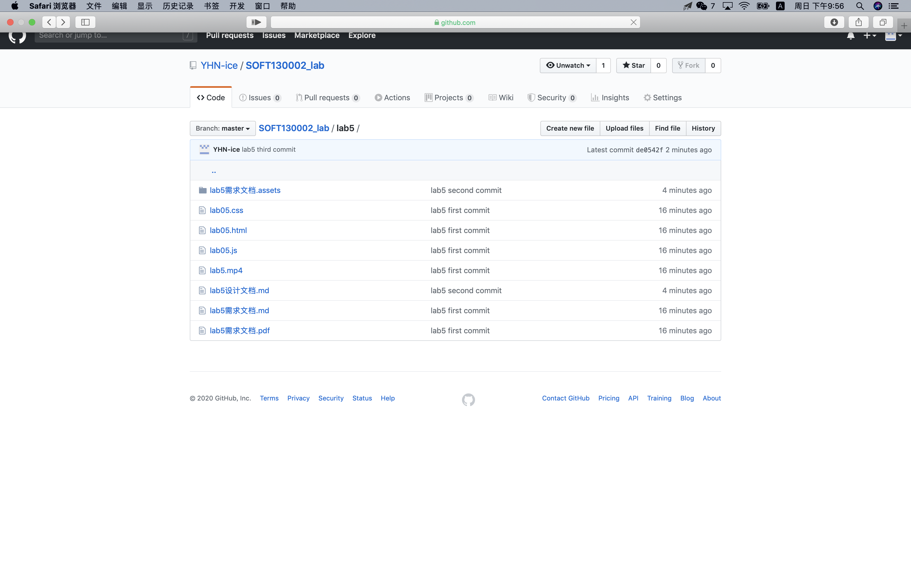

Lab5设计文档
====
### 函数相关知识点
for语句 if else 语句 String的substring函数 使用了addEventListener函数 setInterval、clearInterval和setTimeout函数 将函数名赋给变量 
### 问题的解决方案

----
1、首先`i`遍历`url.value`找到`？`接着`j`再遍历`？`后的字符，找到`&`以后判断是否符合`name=`前缀，如果符合就用`substring(start,end)`方法取`=`以后`&`之前的`value`部分赋值给`url_result.value`,或者没有`&`，则只有一组`key:value`遍历至`url.value`末尾，再用`substring(start)`方法取`=`以后的部分赋值给`url_result.value`。并且每当`j`找到`&`,便将当前索引赋值给`i`作为下一组的起点。

----
2、用`addEventListener`方法给`mul`输入框设定`click`的事件监听,触发`timeTest`函数。函数里用`setInterval(function, milliseconds)`使每过5秒就进行判断,如果执行满十次，通过`clearInterval(timeInterval)`来停止该`timeInterval`,未满十次则使` mul.value`翻倍，并`count++` 。当第一次执行时，用`setTimeout(function, milliseconds)`设置一个`Timer`，以便在未满十次但是当前这一分钟走完时执行`clearInterval(timeInterval)`，以达到"到某一整分钟停止"的效果。

----
3、先声明两个数组`chars`和`times`,分别存放`most.value`里面去重以后的字符和各字符出现的次数。用`for`循环遍历`most.value`，并通过`for`循环遍历`chars`来检查字符是否已出现（`most.value`中的第一个字符直接加入`times`中），若已出现，则对应索引处的`times[j]++`,否则向`chars`中加入新的元素，并`times[newIndex] = 1`，最后通过`for`循环比较得出`times`中最大值的索引，得到出现次数最多的字符和相应的次数

### GitHub截图

----

### 网页效果截图

----
