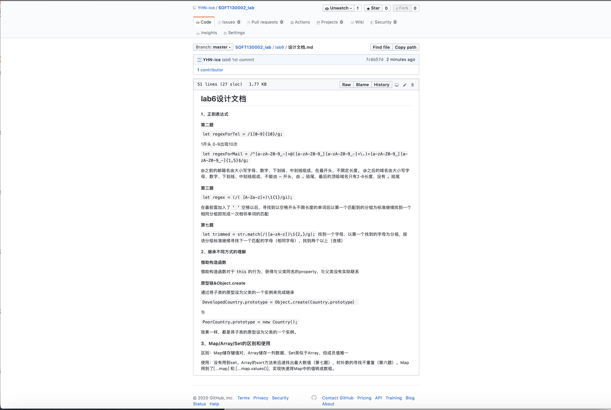
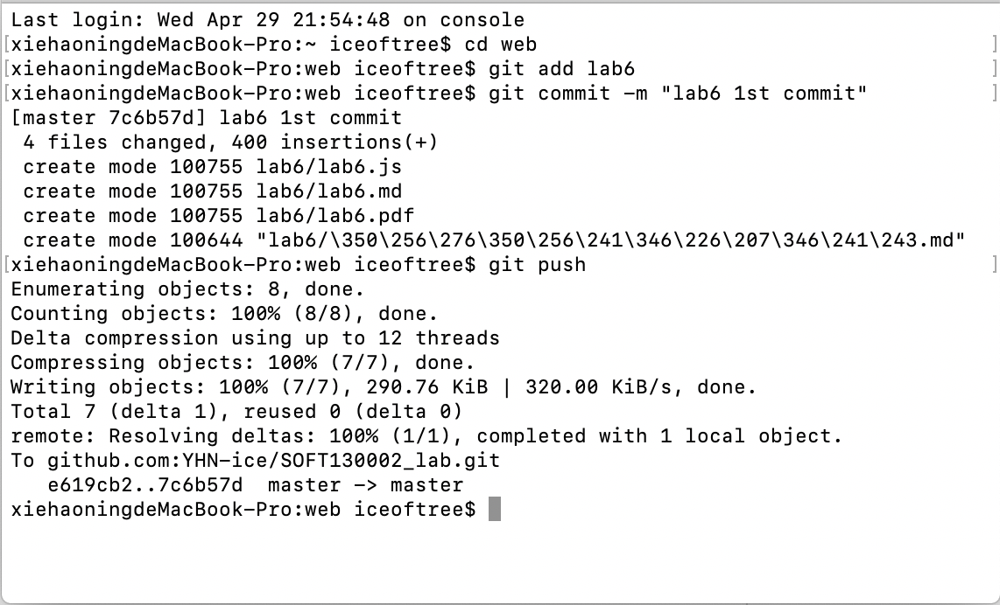

lab6设计文档
====

#### 1、正则表达式

##### 第二题

`let regexForTel = /1[0-9]{10}/g;`

1开头 0-9出现10次

`let regexForMail = /^[a-zA-Z0-9_-]+@([a-zA-Z0-9_][a-zA-Z0-9_-]+\.)+[a-zA-Z0-9_][a-zA-Z0-9_-]{1,5}$/g;`

@之前的邮箱名由大小写字母、数字、下划线、中划线组成，在最开头，不限定长度。
@之后的域名由大小写字母、数字、下划线、中划线组成，不能由`-`开头，由`.`结尾，最后的顶级域名只有2-6长度，没有`.`结尾

##### 第三题

`let regex = (/( [A-Za-z]+)\1{1}/gi);`

在最前面加入了`' '`空格以后，寻找到以空格开头不限长度的单词后以第一个匹配到的分组为标准继续找到一个相同分组即完成一次相邻单词的匹配

##### 第七题

`let trimmed = str.match(/([a-zA-z])\1{2,}/g);`
找到一个字母，以第一个找到的字母为分组，按该分组标准继续寻找下一个匹配的字母（相同字母），找到两个以上（连续）

#### 2、继承不同方式的理解

##### 借助构造函数
借助构造函数对于`this`的行为，获得与父类同名的property，与父类没有实际联系

##### 原型链&Object.create

通过将子类的原型设为父类的一个实例来完成继承

`DevelopedCountry.prototype = Object.create(Country.prototype）`

与

`PoorCountry.prototype = new Country();`

效果一样，都是将子类的原型设为父类的一个实例。

### 3、Map/Array/Set的区别和使用

区别：Map储存键值对，Array储存一列数据，Set类似于Array，但成员值唯一

使用：没有用到set。Array的sort方法来迅速找出最大数值（第七题），时补数的寻找不重复（第六题）。Map用到了[...map] 和 [...map.values()]，实现快速将Map中的值转成数组。

